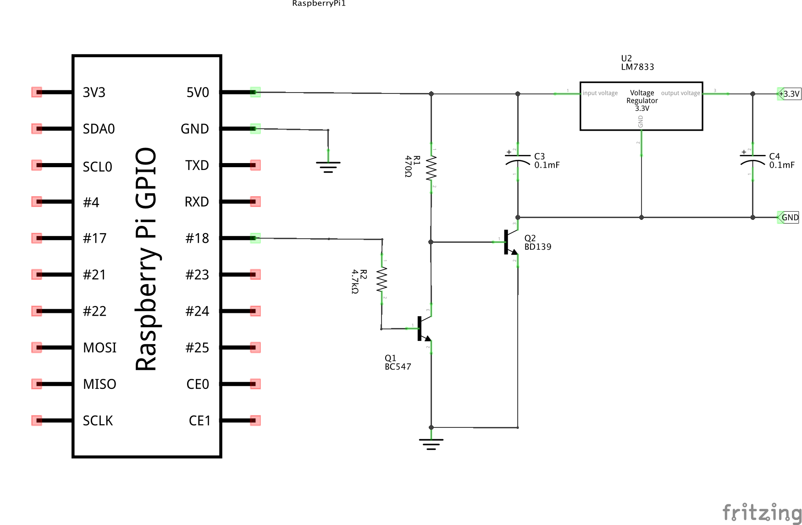

PowerCutter
===========

Simple 3.3V power source for Raspberry Pi pheripherials. Power source can be switched on/off using one of Raspberry Pi GPIOs

Requirements:
* Raspberry Pi
* Python
* RPi.GPIO module https://pypi.python.org/pypi/RPi.GPIO

Parts:
* 2x 2.2kOhm resistors
* 2x 100nF capacitors
* BC547 transistor
* BD139 transistor
* LM7833 Voltage regulator

